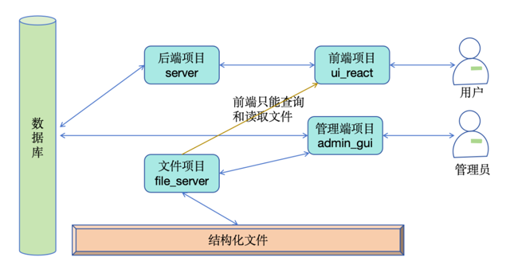
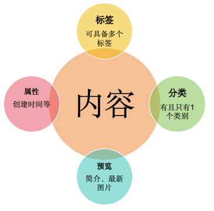

<h1 align="center" style="margin: 30px 0 30px; font-weight: bold;">冷空CMS</h1>
<h4 align="center">基于结构化文本文件、服务器消耗小的内容管理系统</h4>

# 一、整体设计
冷空是一款模块化、结构化的CMS系统，其特点是后端服务器的消耗小。通过以下三种方式来降低消耗：
1. 直接让前端处理和渲染结构化的数据
2. 切割管理功能到单独的项目
3. 切割文件功能到单独的项目
## 1.模块化设计（工程目录）
本项目共分4个子项目，其各自关系如下图：


* 后端项目：详见 server/README.MD，负责与数据库交互、处理业务逻辑，并提供api接口。
* 前端项目：详见 ui_react/README.MD，负责渲染结构化文件、展示界面，并提供用户交互。
* 文件项目：详见 file_server/README.MD，提供文件上传接口和文件读取接口。
* 管理端项目：详见 admin_gui/README.MD，负责整个CMS系统的管理，包含内容的增删改查等。
## 2.结构化文件的设计
本项目将内容以结构化文件的方式存储。在这里，内容，比如说一篇文章，就是一个类似如下的文本文件：
```
{"id":1,"lineType":"header","fontSize":14,"color":"black","bgColor":"white","value":"关于冷空CMS"}
{"id":2,"lineType":"title1","fontSize":12,"color":"black","bgColor":"white","value":"一级标题"}
{"id":3,"lineType":"title2","fontSize":12,"color":"black","bgColor":"white","value":"二级标题"}
{"id":4,"lineType":"body","fontSize":10,"color":"black","bgColor":"white","value":"正文"}
{"id":5,"lineType":"img","value":"1.png"}
```
前端项目将直接读取该文件并进行渲染，结构式数据解析如下：

id ：即文本文件的第几行，界面的第几个段落

lineType：该行的类型，共分7个：
* header ： 大标题，即内容名。
* title1 至 title4 ：一级标题到四级标题。
* body：正文。
* img：图片。

fontSize：字体大小

color：前景色

bgColor：背景色

value： 内容
## 3.内容管理设计(数据库结构)
对于用户来说，导航和快速查找是CMS系统的核心，因此设计3个导引方式：
* 基于时间
* 基于类别
* 基于标签



针对结构化的文件，若要实现管理，必须采用额外的数据库来完成，因此数据库主表设计如下：
```
    `id`            int(10) unsigned NOT NULL AUTO_INCREMENT COMMENT 'ID',
    `header`        varchar(100) NOT NULL COMMENT '大标题',
    `class_id`      int(10) DEFAULT NULL COMMENT '类别ID',
    `label_id_list` varchar(100) NOT NULL COMMENT '标签id列表',
    `create_at`     datetime DEFAULT NULL COMMENT '创建时间',
    `path`          text DEFAULT NULL COMMENT '文章路径',
    `last_img`      text DEFAULT NULL COMMENT '最新图片',
    `detail`        varchar(300) NOT NULL COMMENT '文章描述',
```  
## 4.权限设计
一开始就没有设计权限，以后估计也不会添加。但是万一有个意外，先记录一下简单的想法：

1. 读权限：server单方向发送一个key给file_server，用以判断用户是否具有读权限。
2. 写权限：admin_gui单方向发送一个key给file_server，用以判断管理员是否具有写权限。 
   
这是个面向全部用户的系统，未对用户进行分类。其实也简单分为了两类：普通用户和管理员。

**说到这，需要重点注意，严格控制admin_gui程序，只应该安装在少数电脑上让少数人专用。**

# 二、快速开始
## 1.数据库部署
本项目默认采用mysql数据库。如果使用其他数据库，需自行更换admin_gui和server项目中的数据库驱动。
### (1)修改默认密码
本项目默认数据库连接密码为 **root / lengkong#CMS1234**,请修改对应配置：
* server里的xx
* admin_gui里的xx
### (2)建表
创建数据库lk_cms。
```
CREATE DATABASE IF NOT EXISTS `lk_cms` CHARACTER SET utf8mb4 COLLATE utf8mb4_unicode_ci;
```
然后运行doc/sql/lk_cms.sql。


---
.....待完成