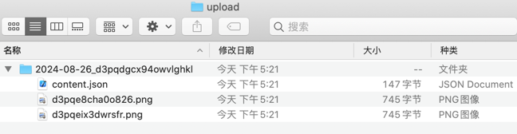

冷空CMS的文件服务子项目，提供文件上传接口和文件读取接口。
* 采用goframe框架 
* 基于本地文件系统

# 一、开发手册
## 1.修改默认配置
在config/config.go中，硬编码配置：
```
var (
	Port  = 9999 //服务运行端口
	UploadPath = "/Users/hanfei/Desktop/upload" //本地文件存储位置
	CORS_allow = []string{"localhost","127.0.0.1"} //允许cors的白名单

	UploadKey = "d282a7vrhcq0kvzp39" //请求头key字段，用于API服务的访问控制
	SelfFileServer = true //提供file路径用于加载文件读取服务。建议采用nginx并改为false
)
```
## 2.编译程序
使用 go build 编译打包。

## 3.部署
使用GoFrame开发的应用程序有三种部署模式，分别是独立部署、代理部署、容器部署，详见官方部署指南：

https://goframe.org/pages/viewpage.action?pageId=1114403

**由于该子项目作为文件服务使用，建议结合nginx使用代理部署模式，该模式下应将配置中的SelfFileServer设为false。**

# 二、使用说明（api接口）
## 1.api接口
```
//返回随机目录
type GetPathReq struct {
	g.Meta   `path:"/getPath" method:"get" summary:"获取随机目录"`
}

//无特定返回
type FileUploadReq struct {
	g.Meta   `path:"/upload" method:"post" summary:"文件上传"`
	File string `json:"file" type:"file" dc:"选择上传文件"`
	Path string `p:"path" v:"required#路径不能为空"`
}

//返回生成的图片路径
type ImgUploadReq struct {
	g.Meta   `path:"/uploadImg" method:"post" summary:"图片上传"`
	Img string `json:"img" type:"file" dc:"选择上传图片"`
	Path string `p:"path" v:"required#路径不能为空"`
}

//无特定返回
type DeleteReq struct {
	g.Meta   `path:"/delete" method:"get" summary:"删除文件"`
	Path string `p:"path" v:"required#路径不能为空"`
}
```
## 2.调用方法
1. 访问/article/getPath，获取随机路径名。请求参数需包含key。
```
 ~ curl http://127.0.0.1:9999/article/getPath -H key:d282a7vrhcq0kvzp39
{"code":200,"message":"","data":"2024-08-26_d3pqdgcx94owvlghkl"}
```
2. 上传文件，文件将保存为指定路径下的content.json。请求参数需包含key和随机路径。
```
 ~ curl http://127.0.0.1:9999/article/upload -H key:d282a7vrhcq0kvzp39 -X POST -F "path=2024-08-26_d3pqdgcx94owvlghkl" -F "file=@/Users/hanfei/1.txt"
{"code":200,"message":"","data":"上传成功"}
```
3. 上传图片，将保存为指定路径下的随机png格式图片。请求参数需包含key和随机路径。
```
 ~ curl http://127.0.0.1:9999/article/uploadImg -H key:d282a7vrhcq0kvzp39 -X POST -F "path=2024-08-26_d3pqdgcx94owvlghkl" -F "img=@/Users/hanfei/sql.txt"
{"code":200,"message":"","data":"2024-08-26_d3pqdgcx94owvlghkl/d3pqe8cha0o826.png"}
```
4. 删除指定路径。请求参数需包含key和随机路径。
```
 ~ curl http://127.0.0.1:9999/article/delete\?path\=2024-08-26_d3pqdgcx94owvlghkl  -H key:d282a7vrhcq0kvzp39
{"code":200,"message":"","data":"删除成功"}
```

# 三、文件服务设计
一个目录即代表一篇文章。

该目录下必有且只有1个content.json文件，即文章的内容。

此外还将有多个png格式图片。图片以连接的方式嵌进content.json里。

